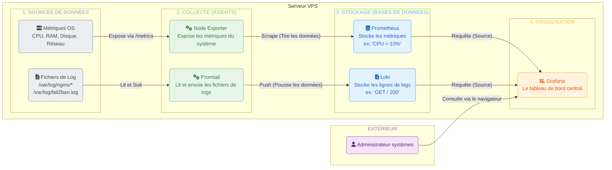

```mermaid
graph LR
    %% --- Définition des Nœuds ---

    subgraph "Serveur VPS"
        direction LR %% Agencement Gauche-Droite

        %% J'ajoute du style HTML aux titres des subgraphs ici
        subgraph "<b style='color:#B0BEC5'>1. SOURCES DE DONNÉES</b>"
            System("fa:fa-server Métriques OS<br>CPU, RAM, Disque, Réseau")
            Logs("fa:fa-file-lines Fichiers de Log<br>/var/log/nginx/*<br>/var/log/fail2ban.log")
        end

        subgraph "<b style='color:#A5D6A7'>2. COLLECTE (AGENTS)</b>"
            NodeExporter("fa:fa-cogs Node Exporter<br>Expose les métriques du système")
            Promtail("fa:fa-cogs Promtail<br>Lit et envoie les fichiers de logs")
        end

        subgraph "<b style='color:#90CAF9'>3. STOCKAGE (BASES DE DONNÉES)</b>"
            Prometheus("fa:fa-database Prometheus<br>Stocke les métriques<br>ex: 'CPU = 10%'")
            Loki("fa:fa-file-alt Loki<br>Stocke les lignes de logs<br>ex: 'GET / 200'")
        end

        subgraph "<b style='color:#FFCC80'>4. VISUALISATION</b>"
            Grafana("fa:fa-chart-bar Grafana<br>Le tableau de bord central")
        end
    end

    subgraph "<b style='color:#CE93D8'>EXTÉRIEUR</b>"
        User("fa:fa-user Administrateur systèmes")
    end

    %% --- Définition des Flux (Logiques et Aérés) ---
    
    %% Pipeline des Métriques (Haut)
    System -->|Expose via /metrics| NodeExporter
    NodeExporter -->|"Scrape (Tire les données)"| Prometheus
    Prometheus -->|"Requête (Source)"| Grafana

    %% Pipeline des Logs (Bas)
    Logs -->|"Lit et "Suit""| Promtail
    Promtail -->|"Push (Pousse les données)"| Loki
    Loki -->|"Requête (Source)"| Grafana
    
    %% Flux Utilisateur
    User -->|"Consulte via le navigateur"| Grafana

    %% --- Définition des Styles (Couleurs) ---
    
    %% Catégories de services
    classDef sources fill:#ECEFF1,color:#37474F,stroke:#B0BEC5,stroke-width:2px
    classDef agents fill:#E8F5E9,color:#2E7D32,stroke:#A5D6A7,stroke-width:2px
    classDef storage fill:#E3F2FD,color:#1565C0,stroke:#90CAF9,stroke-width:2px
    classDef viz fill:#FFF3E0,color:#E65100,stroke:#FFCC80,stroke-width:2px
    classDef user fill:#F3E5F5,color:#6A1B9A,stroke:#CE93D8,stroke-width:2px

    %% Application des styles aux nœuds
    class System,Logs sources
    class NodeExporter,Promtail agents
    class Prometheus,Loki storage
    class Grafana viz
    class User user
```